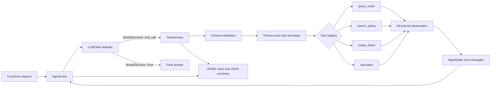
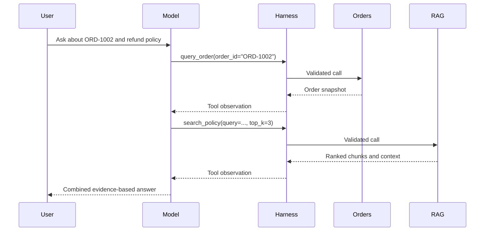

# Enterprise Support Agent

## 2026-09 portfolio delivery

[中文启动与演示](docs/DELIVERY.md) · [自动化与真实模型记录](reports/acceptance-20260907/live-run.json) · [开源归属](docs/ATTRIBUTION.md)

This personal project uses Codex-assisted development. The delivery adds actual image/scanned-PDF OCR, optional pretrained multilingual embeddings, source-aware document management and a lightweight web UI. Business records are synthetic.

An inspectable, provider-neutral customer-support agent that resolves order and policy questions through a real multi-turn tool loop, escalates unresolved cases, produces structured traces, and measures itself with a reproducible 38-task evaluation suite.

The default mode is fully local and deterministic: no API key, hosted vector database, or paid model is required. OpenAI-compatible and Ollama adapters are included for real LLM use.

## 1. Project Overview

This repository models a realistic enterprise support workflow rather than a generic chat interface. A request such as “For `ORD-1002`, explain whether the shipping delay policy applies” cannot be answered safely from model memory. The agent must retrieve live order facts, retrieve company policy, feed both observations back to the decision layer, and only then compose an answer.

The important engineering surfaces are deliberately visible: state, decisions, schemas, dispatch, validation, retries, timeouts, observations, loop detection, stop conditions, traces, and metric calculation.

## 2. Business Problem

Enterprise support teams repeatedly handle requests that cross system boundaries:

- operational facts live in order systems;
- customer commitments live in policy documents;
- arithmetic should be deterministic;
- exceptions need an auditable handoff to people;
- failures must not become fabricated answers.

This project demonstrates a safe orchestration layer over those boundaries. The included JSON data and Markdown policies stand in for order-management and knowledge systems while preserving interfaces that can later be connected to production services.

## 3. Why an Agent Instead of a Chatbot

A chatbot maps text directly to text. This agent maps a request to a sequence of verified actions:

```text
User -> Model Decision -> Tool Call -> Harness Execution -> Observation
     -> State/messages update -> Model Re-decision -> Final Answer
```

The model selects the next action, but the harness retains control over which tools exist, which arguments are valid, how long tools may run, what gets retried, and when execution must stop. Facts returned by tools become new messages; they are not bypassed by hard-coded final answers.

The offline `MockLLM` is intentionally transparent and deterministic for tests and evaluation. It still emits one decision per turn and consumes observations through the same adapter interface. Selecting `openai` or `ollama` swaps in a real model without changing the agent loop.

## 4. Architecture



The model, business tools, and control plane depend on small internal contracts. The loop has no OpenAI-, Ollama-, RAG-framework-, or database-specific control logic.

## 5. Agent Execution Flow

One loop iteration is explicit in [`agent/loop.py`](enterprise_support_agent/agent/loop.py):

1. Increment `turn_count` and ask `LLMClient.decide()` for one `ModelDecision`.
2. If it is final, validate non-empty content and stop with `completed`.
3. If it is a tool call, create a canonical tool-plus-arguments signature.
4. Stop if that signature repeats at the configured threshold.
5. Send the call through the harness; the model never invokes Python functions directly.
6. Append both the assistant tool-call message and structured tool observation to state.
7. Compare observation fingerprints for no-progress detection.
8. Re-enter the loop, or stop at `max_turns`.

For an order-plus-policy request, the expected path is:



## 6. Tool Design

| Tool | Input schema | Output | Role in the chain |
|---|---|---|---|
| `query_order` | `order_id: string` | found flag or verified order fields | operational source of truth |
| `search_policy` | `query: string`, `top_k: 1..10`, optional category enum | ranked chunks, scores, sources, context | policy evidence via local RAG |
| `create_ticket` | request, reason, priority enum, idempotency key | generated ticket ID, status, UTC timestamp | deduplicated durable human escalation |
| `calculator` | `expression: string` | expression and numeric result | deterministic arithmetic |

Schemas are defined once in [`tools/schemas.py`](enterprise_support_agent/tools/schemas.py), sent to the model through the registry, and enforced again inside the harness. Extra fields, missing values, wrong types, invalid enums, and out-of-range values fail before business code runs.

The calculator walks a restricted AST and never calls unrestricted `eval()` or `exec()`. Function calls, names, collections, excessive powers, oversized results, and complex trees are rejected.

## 7. RAG Pipeline

The knowledge path is fully local and inspectable:

```text
Markdown documents -> paragraph-aware chunks -> hashing embeddings
-> category filter -> semantic + lexical score -> Top-K -> cited context
```

Four knowledge-base documents cover refunds, returns, shipping, and after-sales support. [`rag/chunker.py`](enterprise_support_agent/rag/chunker.py) creates stable chunk identifiers. [`rag/embeddings.py`](enterprise_support_agent/rag/embeddings.py) supplies deterministic, dependency-free hashing vectors with English stemming and Chinese bigrams. [`rag/retriever.py`](enterprise_support_agent/rag/retriever.py) combines cosine and lexical scores and returns both ranked results and a ready-to-use context string.

`HashingEmbedder` is a replaceable boundary, not a claim that feature hashing equals a production semantic model. A hosted embedding model, BM25 engine, vector database, or reranker can replace it without changing `search_policy` or the agent loop.

## 8. Harness Design

[`agent/harness.py`](enterprise_support_agent/agent/harness.py) is the trust boundary between probabilistic decisions and deterministic code. It owns:

- tool discovery and invalid-tool handling;
- schema-based argument validation;
- timeout enforcement;
- retry of declared transient exceptions;
- non-retryable exception capture;
- conversion of every outcome into a structured observation;
- per-attempt and total latency trace events.

Handlers return dictionaries. The harness wraps them in a consistent envelope containing `ok`, `data`, `error`, `error_type`, `attempts`, and `latency_ms`. This means failures remain visible to the next model turn instead of escaping the loop or being silently swallowed.

## 9. Reliability and Failure Handling

| Mechanism | Behavior | Stop/error signal |
|---|---|---|
| Maximum turns | bounds total model decisions | `max_turns` |
| Tool timeout | converts slow calls to observations | `tool_timeout` |
| Tool retry | retries only declared transient failures | attempt events in trace |
| Model retry | retries provider failures independently | `model_error` after exhaustion |
| Invalid tool | never dispatches unknown names | `invalid_tool` observation |
| Invalid arguments | rejects before handler execution | `invalid_arguments` observation |
| Repeated call detector | canonicalizes name plus sorted arguments | `repeated_tool_call` |
| No-progress detector | compares normalized observation fingerprints | `no_progress` |
| Empty/invalid model response | rejects malformed terminal behavior | `invalid_model_response` |

Python threads cannot be force-killed safely. On timeout the harness stops waiting, cancels work that has not started, records the failure, and shuts down the executor without blocking. Production adapters should also enforce cancellation in their underlying HTTP or database client.

## 10. Evaluation

[`evals/dataset.json`](evals/dataset.json) contains 38 checked-in tasks spanning order lookup, policy RAG, order-plus-policy composition, ticket creation, arithmetic, missing results, invalid tools, invalid arguments, transient and permanent failures, timeout, repeated calls, max turns, and no progress.

The runner executes every task and derives metrics from final states and tool histories. It writes timestamped JSON and Markdown reports plus stable example files. No metric is hard-coded.

Latest checked-in local/offline example:

| Metric | Result |
|---|---:|
| Tasks | 38 |
| Task Success Rate | 100.00% |
| Tool Selection Accuracy | 100.00% |
| Tool Call Success Rate | 91.84% |
| Average Turns | 2.237 |
| Failure Rate | 7.89% |
| RAG Recall@K | 100.00% |

The non-100% tool-call success and non-zero failure rates are expected: the benchmark intentionally executes unknown, invalid, failing, timed-out, looping, and exhausted paths. See the generated [Markdown report](reports/example_eval_report.md) or [JSON report](reports/example_eval_report.json) for per-task evidence. Latency is machine-dependent and should be read from the current report rather than treated as a portable benchmark.

Run it yourself:

```bash
python -m evals.evaluate --min-task-success 1.0
```

## 11. Demo

```bash
python main.py "Where is order ORD-1002?"
python main.py "What is the refund window?"
python main.py "For ORD-1005, when should the refund be processed?"
python main.py "I need a human to review this complaint"
python main.py "Calculate: (19.99 * 2) + 5"
```

Add `--json` to inspect the complete state. More annotated transcripts are in [`docs/demo.md`](docs/demo.md).

## 12. Project Structure

```text
.
├── enterprise_support_agent/
│   ├── agent/             # state, loop, harness, trace, composition root
│   ├── llm/               # protocol, mock, OpenAI-compatible, Ollama adapters
│   ├── rag/               # documents, chunks, embeddings, retrieval
│   ├── tools/             # schemas, registry, four business tools
│   ├── cli.py
│   └── config.py
├── data/
│   ├── orders.json
│   └── policies/          # refund, return, shipping, after-sales Markdown
├── prompts/system_prompt.txt
├── evals/
│   ├── dataset.json       # 38 tasks
│   └── evaluate.py
├── tests/                 # 51 pytest cases
├── reports/               # checked-in example JSON and Markdown eval reports
├── docs/demo.md
├── .github/workflows/ci.yml # Python 3.11/3.12 test and eval gate
├── logs/                  # runtime traces; generated files are ignored
├── main.py
├── pyproject.toml
├── requirements.txt
└── .env.example
```

## 13. Installation

Requires Python 3.11 or newer.

```bash
git clone https://github.com/Xrrr1111/enterprise-support-agent.git
cd enterprise-support-agent
python -m venv .venv
```

Activate the environment on macOS/Linux:

```bash
source .venv/bin/activate
```

Or on Windows PowerShell:

```powershell
.venv\Scripts\Activate.ps1
```

Install in editable development mode:

```bash
python -m pip install -e ".[dev]"
python -m pytest -q
```

Runtime dependencies cover PDF parsing, image handling, and local OCR; compatible ranges are declared in `requirements.txt` and `pyproject.toml`.

## 14. Usage and Model Providers

Local deterministic mode is the default:

```bash
python -m enterprise_support_agent "Check ORD-1002 and explain shipping policy"
```

OpenAI-compatible mode:

```bash
export ESA_LLM_PROVIDER=openai
export ESA_LLM_MODEL=gpt-4.1-mini
# Set OPENAI_API_KEY in your shell or secret manager before running this command.
python -m enterprise_support_agent "Where is ORD-1002?"
```

Ollama mode:

```bash
export ESA_LLM_PROVIDER=ollama
export ESA_LLM_MODEL=deepseek-r1:8b
python -m enterprise_support_agent "What is the return policy?"
```

Copy `.env.example` as a reference, but note that this dependency-free implementation reads environment variables directly and does not automatically load `.env`. Never commit API keys. Provider behavior depends on whether the selected model reliably supports tool calling.

## 15. Limitations

- Order data is static JSON rather than an authenticated order-management API.
- Tickets are append-only JSONL with idempotency-key deduplication, but without identity, assignment, or SLA workflows.
- The local hashing retriever is appropriate for this small corpus, not large-scale semantic search.
- Customer identity and order ownership are not verified; production use must authorize every lookup.
- Thread-based timeouts cannot terminate already-running Python code.
- The deterministic mock adapter provides reproducibility, but real-provider accuracy needs a separate recorded evaluation run.
- The lightweight web UI is a single-process local demo; conversation persistence, PII redaction, and a prompt-injection policy layer are not included.

## 16. Future Work

- Connect authenticated order, payment, logistics, and CRM APIs behind the existing tool contracts.
- Add hybrid BM25/vector retrieval, a learned reranker, document versioning, and citation-level faithfulness checks.
- Introduce customer identity, tenant boundaries, field-level authorization, PII redaction, and audit retention.
- Support parallel independent tool calls while preserving deterministic traces.
- Record provider-specific eval baselines, cost, token use, calibration, and regression thresholds in CI.
- Add OpenTelemetry spans and dashboards for model/tool latency and failure cohorts.
- Add adversarial tests for prompt injection, policy conflicts, stale knowledge, and malicious tool arguments.

## Verification

```bash
python -m pytest -q
python -m evals.evaluate --min-task-success 1.0
python -m enterprise_support_agent "For ORD-1002, explain the shipping policy"
```

Current local verification: **58 tests passed** and **38 evaluation tasks executed**. The reports are artifacts of actual runs, not manually authored claims. The evaluation uses Mock decisions, not live-model accuracy.
